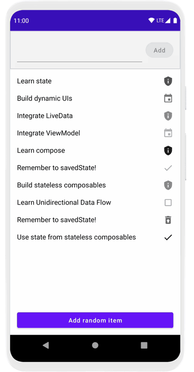

# Using State in Jetpack Compose Codelab

This folder contains the source code for the [Using State in Jetpack Compose codelab](https://developer.android.com/codelabs/jetpack-compose-state).

In this codelab, you will explore patterns for working with state in a declarative world by building a Todo application. We'll see what unidirectional
data flow is, and how to apply it in a Jetpack Compose application to build stateless and stateful composables.

## Screenshots

## Notes
- `Recomposition` is the process of running the same composables again to update the tree when their data changes
- `side-effect` is any change that's visible outside of a composable function. Recomposing a composable should be side-effect free. For example, updating state in a ViewModel, calling Random.nextInt(), or writing to a database are all side-effects.
- `remember` gives a composable function memory. A value computed by `remember` will be stored in the composition tree, and only be recomputed if the keys to `remember` change. You can think of `remember` as giving storage for a single object to a function the same way a private val property does in an object.
- Remember stores values in the Composition, and will forget them if the composable that called remember is removed. This means you shouldn't rely upon `remember` to store important things inside of composables that add and remove children such as `LazyColumn`. For example, animation state for a short animation is safe to remember in a child of LazyColumn, but a Todo task's completion would be forgotten on scroll if remembered here.
